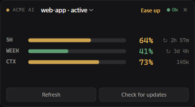
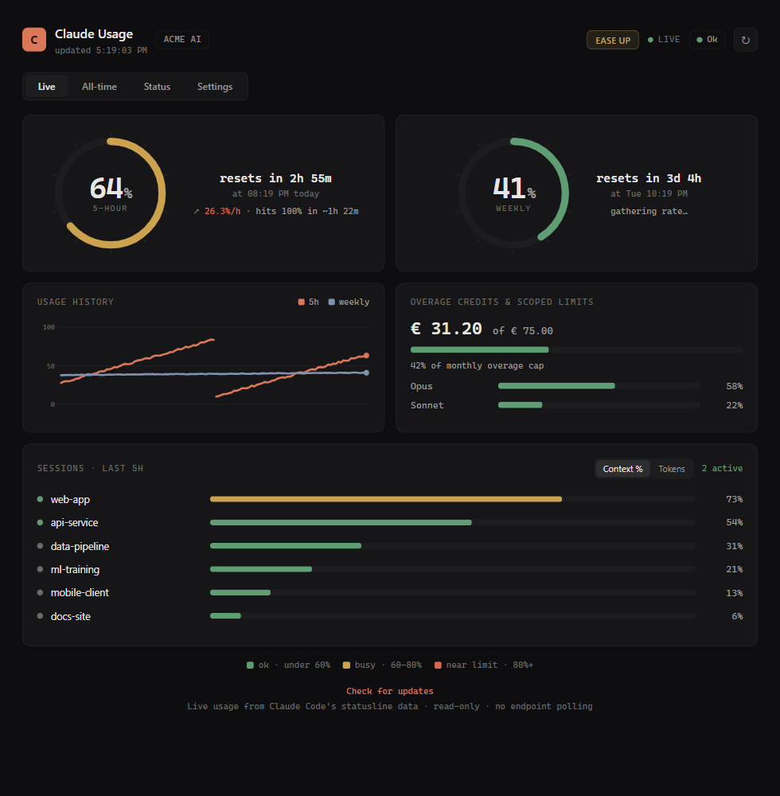

<p align="center"></p>

# Claude Usage Tracker

A small Windows desktop widget that tracks your Claude plan limits — the **5-hour**
and **weekly** usage windows, the exact numbers the `/usage` command shows — with a
live always-on-top widget, a glass dashboard, a tray icon, and a toast notification
every time usage crosses a 20% mark.

It reads the OAuth token Claude Code already stores on your machine and calls the
same endpoint `/usage` uses. **Read-only** — it never modifies your credentials and
talks to nothing but that one Anthropic endpoint.

<p align="center">
  <br>
  <em>The always-on-top mini widget (sample data)</em>
</p>

<p align="center">
  <br>
  <em>The full dashboard — gauges, live reset countdowns, burn-rate, history, credits (sample data)</em>
</p>

## Features

- **Always-on-top mini widget** — a tiny frameless, draggable strip that stays on
  top so your usage is always glanceable. Toggle it from the tray.
- **Full dashboard** — animated ring gauges, live reset countdowns, a **burn-rate /
  time-to-limit projection** ("≈7%/h · hits 100% in ~1h 10m"), a usage history
  sparkline, overage credits, and per-model (Opus/Sonnet) scoped weekly limits.
- **Live tray icon** — two bars (left = 5h, right = weekly) that fill and change
  colour with usage.
- **20% notifications** — a Windows toast each time the 5h or weekly window crosses
  20 / 40 / 60 / 80 / 100%. The first reading is recorded silently, so you only get
  pinged on *future* crossings, never a burst at startup.
- **Auto-start on login**, single-instance, graceful rate-limit (HTTP 429) back-off,
  and automatic pickup of account/token changes (it re-reads your login each poll).

### Colour scale

Bars and gauges share one scale (low → high):

| Range | 0–20% | 20–60% | 60–80% | 80–90% | 90–99% | 100% |
|-------|:-----:|:------:|:------:|:------:|:------:|:----:|
| Colour | green | blue | orange | red | black | yellow |

The 90–99% "black" band gets a red glow/outline so it reads as danger rather than
empty.

<p align="center">
  <br>
  <em>Tray icon at 5/40, 45/72, 85/94, 95/100, and 0/0 percent</em>
</p>

## Install

**Requirements**
- Windows 10 / 11
- Python 3.11+ — install from [python.org](https://www.python.org/downloads/) and tick
  **"Add python.exe to PATH"**
- Claude Code installed and logged in, so `~/.claude/.credentials.json` exists
- Edge **WebView2** runtime (preinstalled on Windows 11; otherwise a free
  [download](https://developer.microsoft.com/microsoft-edge/webview2/)) — for the
  dashboard/widget windows

**Steps**

```bash
git clone https://github.com/paris-paraskevas/claude-usage-tracker.git
cd claude-usage-tracker
python install.py
```

That's all. `install.py` will:
1. create a local virtualenv (`.venv`) and install dependencies,
2. generate the app icon,
3. add **Desktop + Start Menu + Startup** shortcuts (so it auto-starts on login).

Then launch **Claude Usage Tracker** from the Start Menu or Desktop (or run the
command `install.py` prints). The mini widget appears top-right and a tray icon
appears by the clock. Uninstall the shortcuts any time with `python uninstall.py`.

## Usage

Launch "Claude Usage Tracker" from the Start Menu/Desktop, or run it directly:

```bash
.venv\Scripts\pythonw.exe claude_usage_tracker.py
```

Tray menu: **Show/Hide widget**, **Open dashboard** (native window), **Open in
browser**, **Refresh now**, open config/log, **Quit**. The widget has a `×` to hide
it; drag it anywhere.

CLI:

```bash
.venv\Scripts\python.exe claude_usage_tracker.py --once          # print status once
.venv\Scripts\python.exe claude_usage_tracker.py --once --debug  # + raw API JSON
.venv\Scripts\pythonw.exe claude_usage_tracker.py --widget       # just the widget
.venv\Scripts\pythonw.exe claude_usage_tracker.py --window       # just the dashboard window
.venv\Scripts\python.exe claude_usage_tracker.py --uninstall-autostart
```

## Configuration

Edit `config.json` (created on first run, in the app's data dir), then restart:

| Key | Default | Meaning |
|-----|---------|---------|
| `poll_interval_seconds` | `60` | How often to check usage. |
| `threshold_step` | `20` | Ping every N percent. |
| `windows` | `["five_hour", "seven_day"]` | Which limits to notify on. |
| `notify_at_100` | `true` | Ping when a limit hits 100%. |
| `notify_on_start` | `true` | One summary toast at launch. |
| `dashboard_port` | `8787` | Local dashboard port. |
| `show_widget_on_start` | `true` | Show the mini widget at launch. |
| `widget_width` / `widget_height` | `392` / `150` | Widget size in pixels. |

## How it works

`GET https://api.anthropic.com/api/oauth/usage` with the bearer token from
`~/.claude/.credentials.json` (`claudeAiOauth.accessToken`) and the
`anthropic-beta: oauth-2025-04-20` header. The response carries `five_hour`,
`seven_day`, scoped per-model weekly limits, overage `spend`, and reset timestamps —
the same data the CLI's `/usage` renders.

Token refresh is handled by Claude Code itself; if your login expires, the tracker
shows an error state until you run any `claude` command to refresh it. The token is
only ever read — never written, logged, or sent anywhere but that endpoint.

## Layout

```
claude_usage_tracker.py   the whole app (tray, server, dashboard+widget HTML, poller)
install.py / uninstall.py shortcut setup / teardown
requirements.txt          pystray, Pillow, winotify, pywebview
docs/                     screenshots
```

Runtime files (`config.json`, `state.json`, `history.json`, `*.log`) live next to the
script (or in `%LOCALAPPDATA%\ClaudeUsageTracker` when packaged) and are git-ignored.
